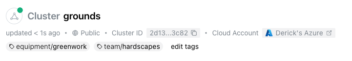
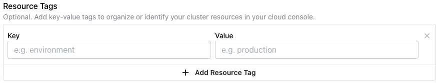
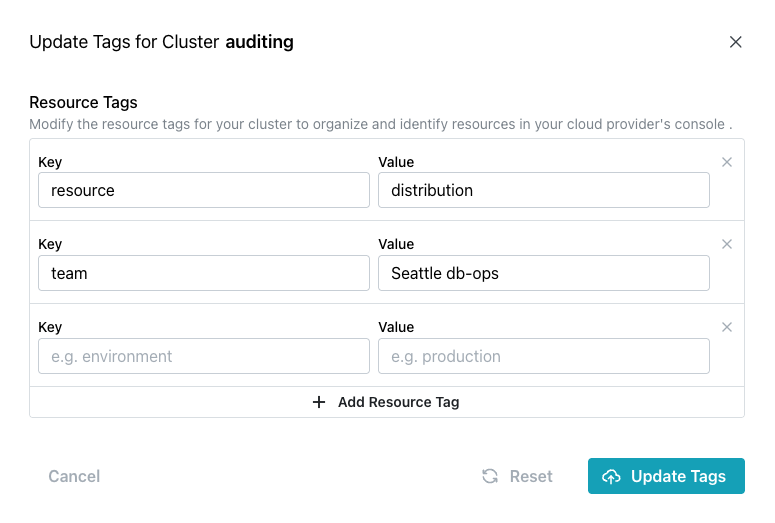

# Using Resource Tags

A resource tag is a user-defined key/value information pair that you attach to your cluster definition.  The tag is displayed under the cluster name on the `Clusters` page.  

You can use tags to categorize your cloud resources or search for resources that are used for specific teams or applications.  For example, you may want to include a tag that specifies `team/ db-ops` to make it easy to identify the resources that are used by the `db-ops` team.

To add a resource tag to a cluster that was created without resource tags, select `Manage Tags` from the `Actions` drop-down, and then select `Add Resource Tag`; specify the `Key` and `Value` to add resource tags.  The new tags will be displayed with a `/` used as a delimiter.  After defining the tag(s), select `Update Tags` to update the tags associated with the cluster.

!!! note

    The `Key` for each resource tag must be unique among the keys for the selected cluster.

To modify the resource tags associated with a cluster, select the `Edit tags` label in the cluster header or `Manage Tags` from the `Actions` drop-down.

* To change the `Value` associated with a `Key`, type over the currently displayed value.

* To add a new resource tag, select `Add Resource Tag`, and then specify the `Key` and `Value` in the open fields.

When you're finished, select `Update Tags` to update the tags associated with the cluster.
